<p align="center">
  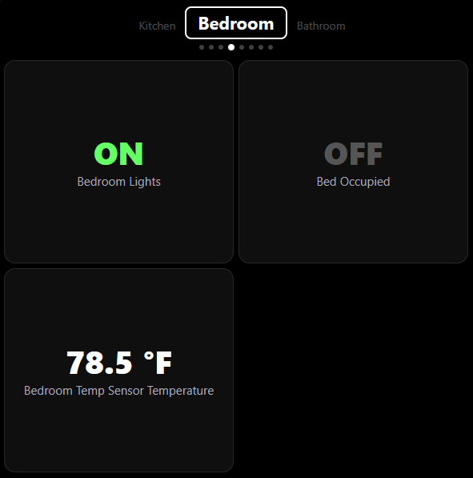
</p>

# Smart Glasses for Home Assistant

[![HACS Custom][hacs-shield]][hacs-link]


A HACS integration that adds a small Web App for the Meta Ray-Ban Display
(and any other 600x600 glasses-style HUD) directly to your Home Assistant
instance. Pair the glasses to HA once via a phone, then glance at any 1–8
entities per card and tap them to fire HA services.

[hacs-shield]: https://img.shields.io/badge/HACS-Custom-orange.svg
[hacs-link]:   https://github.com/hacs/integration

## What you get

- **Glasses Web App** at `<your-ha>/smart-glasses-app` — a 600x600 HUD with
  value-first cells, ghost previews of adjacent cards, live WebSocket state,
  and tap, swipe, or keyboard navigation. Sensitive items can require a
  second tap before they fire.
- **Management panel** at `<your-ha>/smart-glasses` — approve pairings,
  edit cards in the consolidated Dashboard, flip inline **Confirm** toggles,
  drop into YAML for advanced rules, and review recent audit events.

## How it fits together

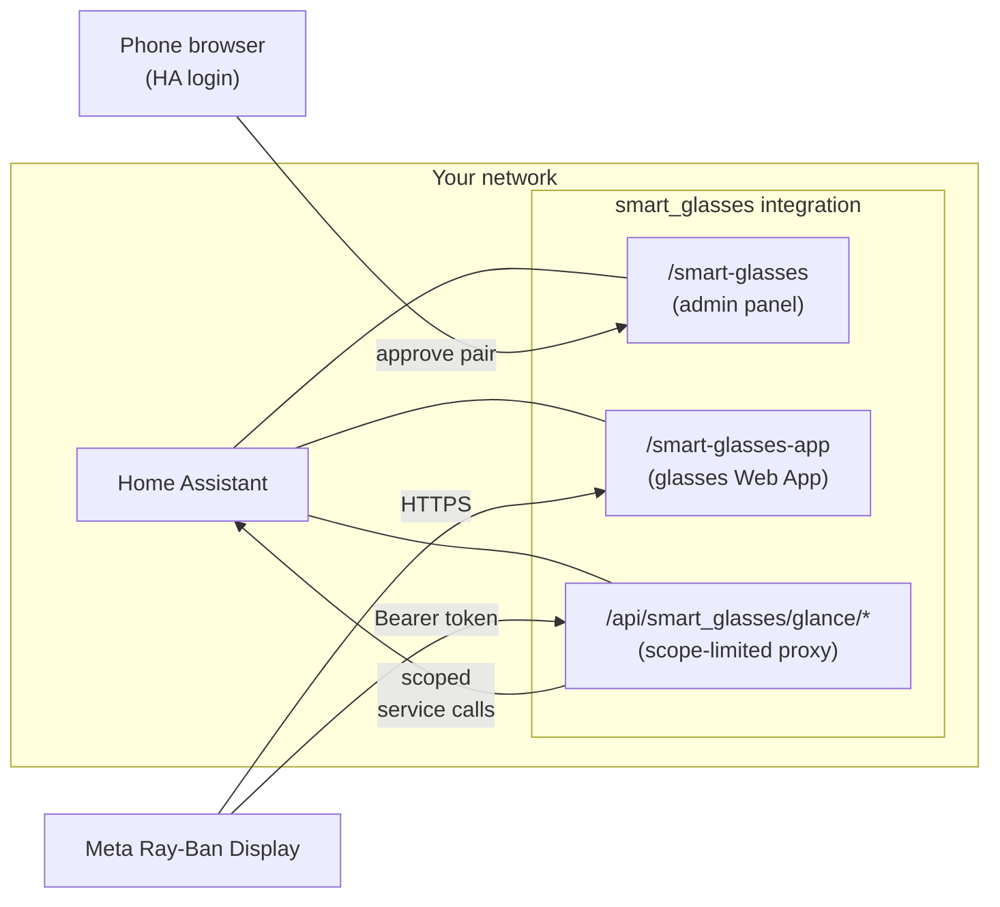

## Why a HACS integration (and not a separate cloud app)?

- Uses **HA's own user system** for auth — no Cloudflare Tunnel, no separate
  identity layer. The phone you pair from logs into your HA exactly the way
  you always log into HA.
- Lives **inside your HA**. No external dependencies, no public site to keep
  running, no secrets to rotate. Stops when HA stops; restarts with it.
- **Distributable**. Once installed via HACS, anyone with HA can use this.

## Install

1. **HACS** → ⋮ → **Custom repositories** → URL
   `https://github.com/runningoec/hacs-smart-glasses`, category **Integration** → **Add**.
2. Find "Smart Glasses" in HACS → **Download**.
3. Restart Home Assistant when prompted.
4. **Settings → Devices & Services → + Add Integration → "Smart Glasses"** —
   one click, no questions. The panel appears in your sidebar.

Then:

5. Open the **Smart Glasses** panel in the sidebar → use the **Dashboard**
   card to add up to 8 items per card → **Save changes**.

## Configure on the panel

The panel is organized around two always-visible cards and three supporting
collapsibles:

- **Glasses pairings** stays at the top for the day-to-day flow: approve a
  new device, or revoke one that should no longer have access.
- **Dashboard** is the main editor: card pills across the top, rename/delete
  controls, current items with inline **Confirm** toggles, and **Entity** /
  **Custom action** subtabs for adding more.
- Saving shows immediate feedback, and the glasses pick up card-definition
  changes in the background within about a minute.

<p align="center">
  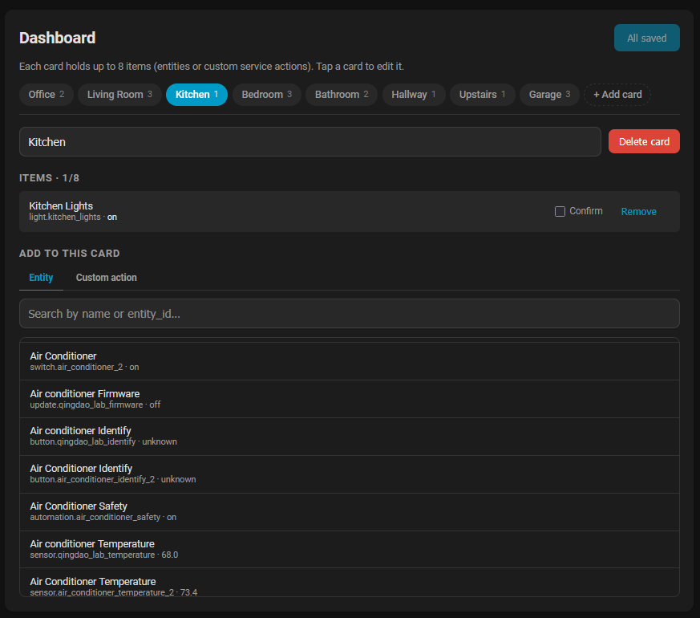
</p>

<p align="center">
  
</p>

### YAML / AI-assisted edits

The built-in YAML editor is the escape hatch for bulk edits, AI-generated
layouts, and advanced fields the inline form does not express well. In
particular, time-window `confirm:` rules live here; the Dashboard reflects
them back as a read-only pill so you can see they are active without
flattening the config.

<p align="center">
  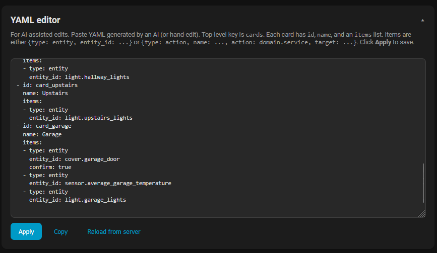
</p>

### Collapsible utilities

Below the core pairings and Dashboard cards, the panel keeps **Add to your
glasses**, **YAML editor**, and **Audit log** in matched collapsibles so the
page stays compact once you're set up, but still exposes the full workflow
when you need it.

<p align="center">
  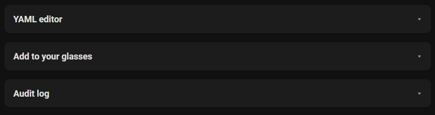
</p>

## Add to your glasses

You need a way for your HA to be reachable from the open internet on HTTPS
(Nabu Casa, a Cloudflare Tunnel, or your own reverse proxy with a TLS cert
— whatever you already use to reach HA from outside the house). The
glasses fetch the Web App from that URL.

**Minimum versions**: Meta Ray-Ban Display firmware ≥ `v125`, Meta AI app ≥ `v272`.

The panel's **Add to your glasses** card mirrors the same setup flow and
gives you a copyable Web App URL:

<p align="center">
  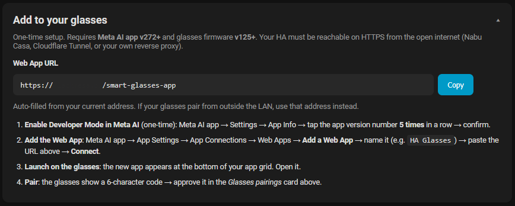
</p>

### 1. Enable Developer Mode on your phone (one-time)

Skip this if Developer Mode is already on.

1. Open the **Meta AI app**.
2. **Settings → App Info** → tap the **app version number 5 times in a row**.
3. Confirm the prompt that appears. Developer Mode now persists across sessions.

### 2. Add the Web App

1. **Meta AI app → App Settings → App Connections → Web Apps → Add a Web App**.
2. **App name**: `Smart Glasses HA` (or whatever you like).
3. **URL**: `https://<your-ha-public-domain>/smart-glasses-app`
4. Tap **Connect**.

The app appears immediately at the bottom of your Meta Ray-Ban Display app grid.

### 3. Pair the glasses to HA (one-time per glasses)

1. Launch the app on the glasses. You'll see a **6-character pairing code**
   (e.g. `R7P9XQ`) and a hint pointing to `<your-ha>/smart-glasses`.
2. On your phone, open `<your-ha>/smart-glasses` (you're already logged in
   to HA so the panel just opens).
3. In the **Glasses pairings** card, click **Approve** next to the matching
   code (or open the typed-code fallback and submit it there).
4. Within a couple seconds the glasses switch from the pairing screen to
   the live entity grid. Pairing is sticky — the glasses remember the
   token and skip step 3 from now on.

<p align="center">
  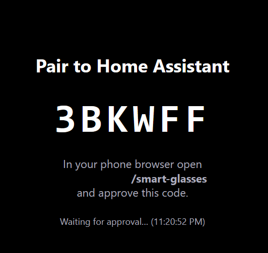
  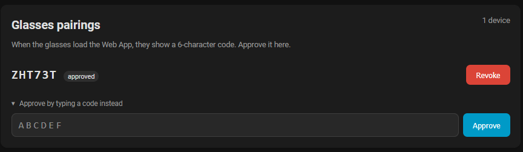
</p>

#### Pairing flow

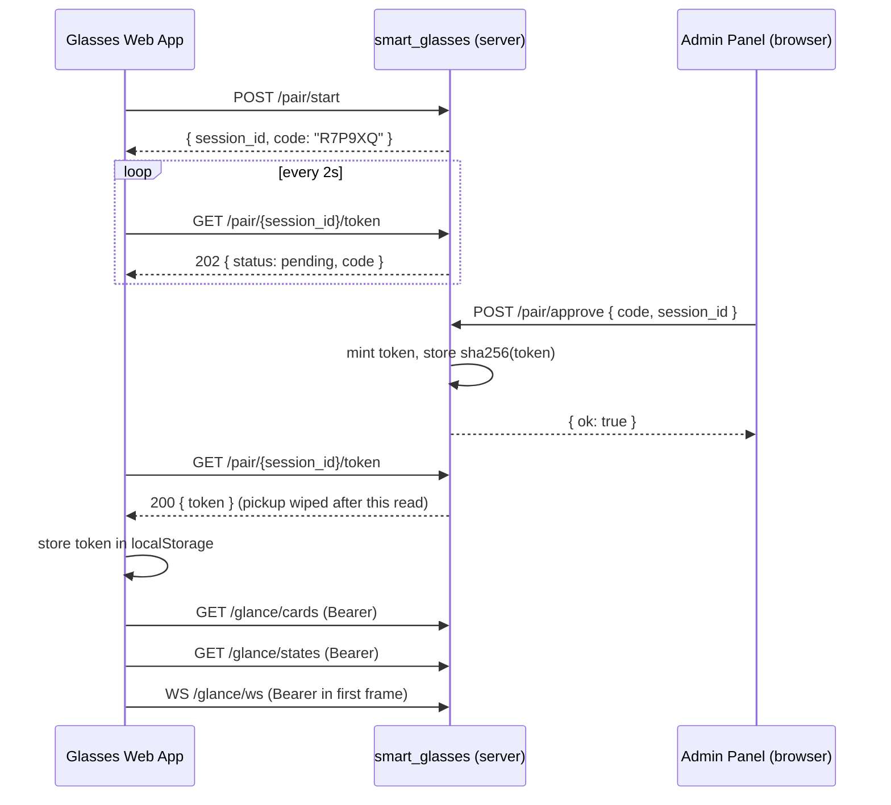

### Re-pair / hand off to a different account

On the glasses, hold **Shift + Escape** in the Web App to wipe local
credentials and start over. From the HA panel, **Revoke** kills the
token at the HA side too (the long-lived access token is removed from
the approving user's profile).

## Pairing security

Approval mints a 256-bit random session token. Only the **hash** of that
token is stored on your HA — the plaintext is handed to the glasses once
through `/pair/<id>/token` and then wiped from server-side state. Any
glasses-side API call is Bearer-authenticated against the hash.

The token's scope is exactly **the entities + actions currently on a card**.
It cannot enumerate the rest of your HA, can't fire arbitrary services,
can't subscribe to events for unrelated entities. The glasses never talk to
HA's native `/api/*` — every call goes through scope-limited proxies:

| Glasses call | Backend behavior |
|---|---|
| `GET /api/smart_glasses/glance/cards`        | Returns current cards. |
| `GET /api/smart_glasses/glance/states`       | Returns states **only** for entity_ids that appear on a card. |
| `POST /api/smart_glasses/glance/call_service` | Rejects any (domain, service, target) tuple that isn't either (a) `homeassistant.toggle` against an entity item on a card, or (b) an exact match for an action item on a card. |
| `WS  /api/smart_glasses/glance/ws`            | First message authenticates; thereafter streams `state_changed` events filtered to card entities. |

Revoking from the panel deletes the hash. The next glasses-side call gets
401 and re-pair kicks in.

### Reverse-proxy caveat

`POST /api/smart_glasses/pair/start` is rate-limited at 6 requests/min
**per source IP**. If your HA sits behind a reverse proxy (Cloudflare
Tunnel, Nabu Casa, Traefik, …) without `use_x_forwarded_for: true` in
your HA HTTP config, every request will look like it's coming from the
proxy's IP — so the per-IP limit collapses to a single global bucket
covering *all* clients. The hard cap of **50 pending pairings** (auto-
pruned after 30s of inactivity) is the real backstop in that case;
worst-case spam is ~50 records and ~10 KB on disk that evaporates
seconds later. Not catastrophic, but if you want per-client rate
limiting, enable `use_x_forwarded_for` and list your proxy under
`trusted_proxies` in HA's `http:` config.

## Navigation on the glasses

The glasses UI has two simple modes: **tabs** at the top of the screen, and
**cells** inside the active card.

<p align="center">
  
  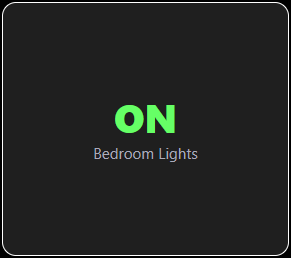
</p>

- In **tabs mode**, the current card name is bright, the previous and next
  card names are dim ghost previews, and the dot row shows where you are in
  the stack.
- Swipe left or right on the title strip to cycle cards. If you're already
  in **cells mode**, moving left from the leftmost cell or right from the
  rightmost cell hands off to the previous or next card instead of stopping.
- Swipe down, press **Down** or **Enter**, or tap the current card title to
  enter **cells mode**.
- In **cells mode**, the focused item gets a bright white border. Tap or
  press **Enter** to fire it; swipe up or press **Escape** to return to the
  tab strip.

## Tap-to-confirm on sensitive items

Any item on a card can carry an optional `confirm` field that gates the
"fire on tap" behaviour behind a second tap. Useful for doors, locks,
alarms, or just bright lights at 2 AM that you don't want to hit by
accident.

```yaml
cards:
  - id: home
    name: Home
    items:
      # Always require a second tap.
      - type: entity
        entity_id: cover.garage_door
        confirm: true

      # Lock-style action — always confirm.
      - type: action
        name: Disarm alarm
        action: alarm_control_panel.alarm_disarm
        target: alarm_control_panel.home
        confirm: true

      # Only require confirm during a window (overnight here — wraps
      # past midnight automatically when after > before).
      - type: entity
        entity_id: light.bedroom_main
        confirm:
          after:  "22:00"
          before: "07:00"
```

When a confirm-gated item is tapped (or Enter'd from the keyboard nav),
the first interaction arms it instead of firing it:

<p align="center">
  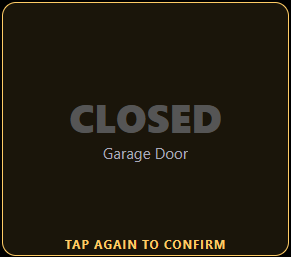
</p>

A second tap within ~5 seconds fires the action; navigating away or
waiting it out cancels.

The Dashboard checkbox sets `confirm: true`. Time-windowed configs are
read-only in the panel UI — set them in the YAML editor.

## Troubleshooting

| Symptom on glasses / panel | What it means | What to do |
|---|---|---|
| Pair code is `------` and never changes | Server returned 429 to `/pair/start` (rate-limited, 6/min per IP) | Wait a minute, re-launch the app. If you're behind a reverse proxy and many people share the apparent IP, enable `use_x_forwarded_for` in HA's HTTP config. |
| Pair code keeps changing every few seconds | An older bug stored the literal string `"undefined"` as the token, causing a relaunch loop. Should be auto-recovered on first load of v0.6.2+. | Open the Web App once; the localStorage scrubbing kicks in and the next code stays stable. |
| `Disconnected. Re-launch the app to retry.` | The glasses tried to reconnect to the WebSocket proxy 20+ times and gave up | Back-gesture out of the app on the glasses and re-launch it. |
| `No pending pairing with code XYZ` in the panel | The cached pairings list is stale | Click **Approve** directly on the row (or refresh the page); the panel re-fetches on each approve attempt as of v0.6.1. |
| `pairing already approved` | The session has a token and was approved earlier | Revoke and ask the glasses to re-pair (Shift+Escape inside the Web App wipes its localStorage). |
| `service call not permitted by card config` (403) | The glasses tried to fire a service that isn't pinned to a card | Add the action to a card in the panel, or use an entity item if the user just wants `homeassistant.toggle`. |
| Panel says `cross-site request rejected` | Your browser sent the API call with `Sec-Fetch-Site: cross-site` | You're hitting the API from another origin; load the panel from your HA's URL, not a third-party site. |
| YAML save fails with `body too large` | YAML payload exceeded 64 KiB | Your dashboard is unusually large; trim cards or split. |

## Status

- **v0.10.2**: consolidated panel layout (pairings, Dashboard, collapsible
  setup/YAML/audit), value-as-headline grid cells, ghost-preview tabs,
  tap-to-confirm with inline or YAML-defined rules, scoped proxy auth,
  audit logging, and row-edge card handoff for Left/Right navigation.
- **Roadmap**: HACS default-store submission, fuller HA integration test
  coverage, brand assets (`icon.png`/`logo.png`), and more translations.
